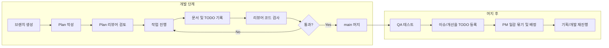

# Workflow

AI 팀원이 따라야 하는 공통 규칙과 역할별 규칙, 브랜치부터 머지·QA·배정까지의 흐름을 정의한다.

---

## 1. 공통 규칙 (모든 AI 팀원)

- **브랜치**: 작업 전 반드시 본인 역할에 맞는 브랜치를 파서 작업한다.  
  - 예: `feature/planner-balance`, `feature/programmer-item-system`, `fix/qa-stage-bug`
- **Plan 선행**: Plan을 작성한 뒤 **Plan 리뷰어** 검토를 받고, 통과 후에만 구현·기획 작업을 진행한다.
- **작업 전**: [TODO.md](TODO.md)에서 내 일감·진행 중인 일을 확인하고, 필요 시 [changelog/](changelog/)·[plan/CurrentStructure.md](plan/CurrentStructure.md)에서 이전 작업 요약·현재 구조를 읽은 뒤 진행한다. 리소스가 필요한 작업은 [resources/Resources.md](resources/Resources.md)를 참고한다.
- **작업 후 필수** (예외 없음):
  - **작업 요약**: 무엇을 했는지(변경 파일, 결정 사항, 이유) [docs/changelog/](changelog/)에 브랜치·날짜별 md로 기록하거나 PR description에 적는다. 머지 후에도 changelog에 남겨 두면 다음 세션에서 복원하기 쉽다.
  - **TODO 기록**: 남은 작업, 개선점, 알려진 이슈를 [TODO.md](TODO.md)에 추가·갱신한다.
- **코드 변경 시**: **리뷰어(코드 검증)**에게 검사를 받는다. 피드백이 있으면 수정 후 **문서를 업데이트**한다. (기획·문서만 변경 시 코드 리뷰는 생략. 팀 정책에 따름)
- **머지**: 리뷰 통과 후에만 **main** 브랜치에 병합한다. 머지 전 [quality/PreMergeChecklist.md](quality/PreMergeChecklist.md)를 확인한다.

---

## 2. 워크플로우 순서

1. **브랜치 생성** → 2. **Plan 작성** → 3. **Plan 리뷰어 검토** → 4. **작업 진행**  
5. **문서 작성 + TODO 기록** → 6. **리뷰어 코드 검사** → 7. **통과 시 main 머지**  
8. **QA 테스트** → 9. **이슈/개선을 TODO 등록** → 10. **PM이 일감 묶고 기획/개발 배정**

---

## 3. 역할별 규칙 요약

| 역할 | 규칙 요약 |
|------|-----------|
| **기획자** | 게임 밸런스·정체성 유지 검토; 기획 문서/기능 명세 정리. [roles/Planner.md](roles/Planner.md) |
| **프로그래머** | 코드 데이터화·컨벤션·게임 구조·핵심 기능 명세 준수; Plan에 따라 구현. [roles/Programmer.md](roles/Programmer.md) |
| **Plan 리뷰어** | Plan 검토·일관성·실행 가능성 확인 후 승인/반려. [roles/PlanReviewer.md](roles/PlanReviewer.md) |
| **리뷰어** | 코드 컨벤션·일관성·기존 기능 유지·확장 안정성·사이드이펙트 검증. [roles/CodeReviewer.md](roles/CodeReviewer.md) |
| **QA** | 머지 후 테스트 실행; 에러·재미 손상·밸런스 이슈 제기; TODO에 개선/이슈 일감 등록. [roles/QA.md](roles/QA.md) |
| **PM** | TODO 일감 정리; 유사 일감 묶기; 성격에 따라 기획자/프로그래머에게 배정. [roles/PM.md](roles/PM.md) |

---

## 4. 브랜치 네이밍

- `feature/<역할-짧은설명>` — 기능 추가 (예: `feature/planner-difficulty-curve`)
- `fix/<역할-짧은설명>` — 버그/이슈 수정 (예: `fix/programmer-item-load`)
- `docs/<설명>` — 문서만 수정 (예: `docs/update-workflow`)

역할 접두 예: `planner`, `programmer`, `qa`, `pm`. Plan 리뷰어·코드 리뷰어는 주로 리뷰만 하므로 브랜치보다는 PR 코멘트로 참여.

---

## 5. Agent Teams 오케스트레이터(MVP)

Agent Teams가 Idle 상태가 되어도 자동으로 다음 단계를 진행하려면 로컬 오케스트레이터를 상시 실행한다.

- 실행 파일: `.claude/orchestrator/Orchestrator.ps1`
- 기본 동작: `docs/TODO.md`, `team-lead inbox` 변경 이벤트를 감지해 상태 전이·재배정
- 작업 상태 저장: `.claude/orchestrator/tasks/*.json`

자동 전이를 위해, 작업 결과 보고는 `TASK_UPDATE` 공통 계약을 따른다.

- 계약 문서: `.claude/orchestrator/TASK_UPDATE_CONTRACT.md`
- 핵심: `TASK_UPDATE_BEGIN/END` 래퍼 + `task_update` JSON
- 역할별 기본 stage/outcome 예시는 각 역할 프롬프트를 따른다.
